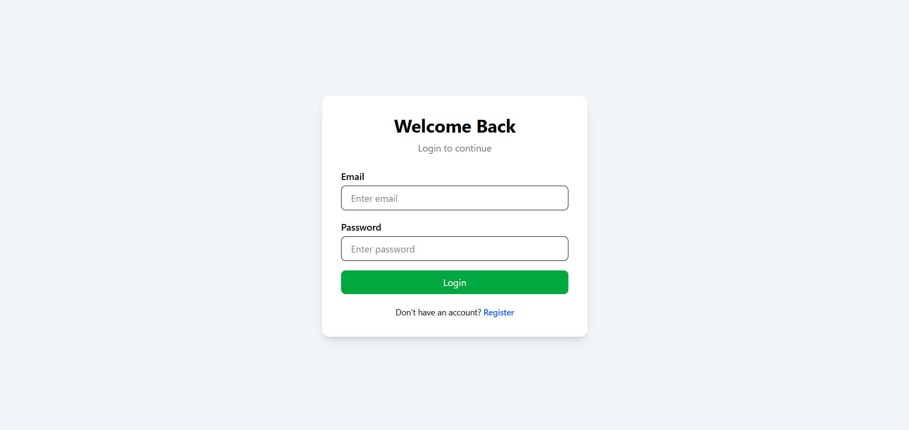
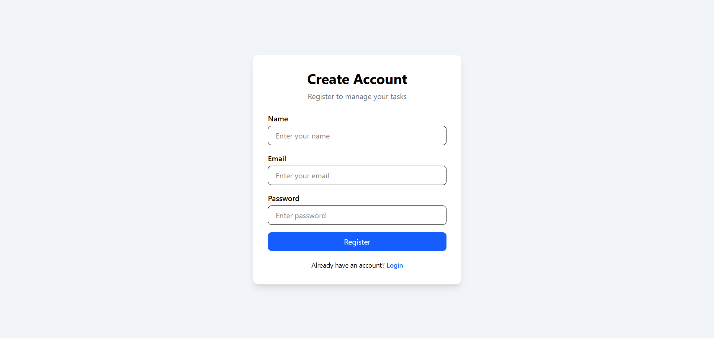
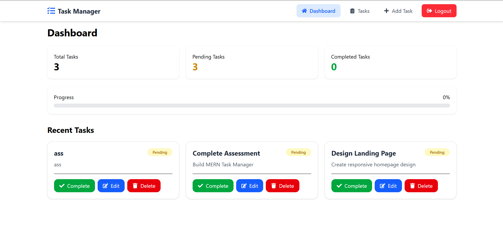
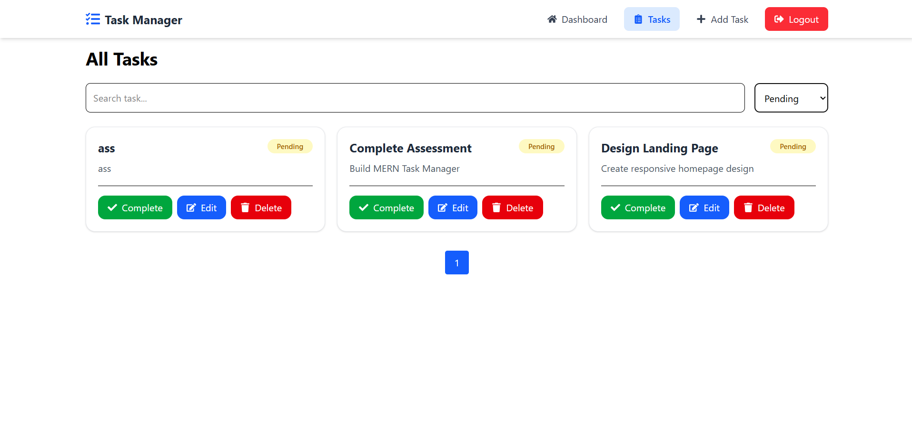
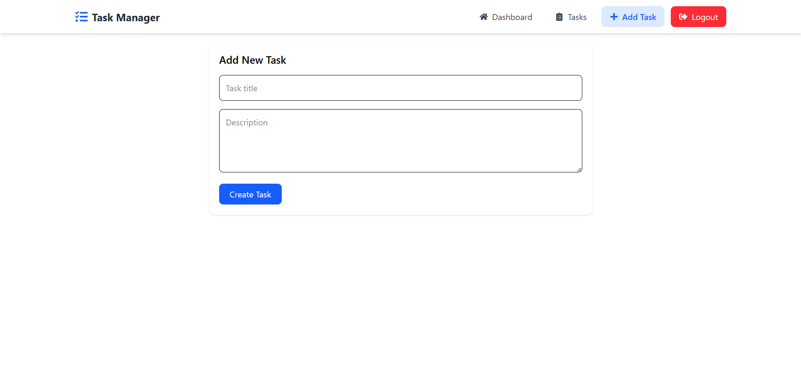

# 🚀 Task Manager

A modern full-stack Task Management application built using the MERN Stack. Users can create, update, complete, and delete tasks while tracking their overall productivity through an interactive dashboard.

---
## 📸 Screenshots

### 🔐 Login Page



### 📝 Register Page



### 📊 Dashboard



### 📋 Tasks Page



### ➕ Add Task Page




## ✨ Features

* User Authentication (JWT)
* Create Tasks
* Update Tasks
* Delete Tasks
* Mark Tasks as Completed
* Task Statistics Dashboard
* Progress Tracking
* Responsive Design
* Mobile Navigation Menu
* Toast Notifications
* Protected Routes

---

## 🛠 Tech Stack

### Frontend

* React.js
* React Router DOM
* Axios
* React Hot Toast
* React Helmet Async
* React Icons
* Tailwind CSS

### Backend

* Node.js
* Express.js
* MongoDB
* Mongoose
* JWT Authentication
* bcryptjs

---

## 📂 Project Structure

```bash
Task-Manager
│
├── client
│   ├── public
│   ├── src
│   │   ├── components
│   │   ├── pages
│   │   ├── services
│   │   ├── routes
│   │   └── App.jsx
│   │
│   └── package.json
│
├── server
│   ├── config
│   ├── controllers
│   ├── middleware
│   ├── models
│   ├── routes
│   ├── server.js
│   └── package.json
│
└── README.md
```

---

## ⚙️ Environment Variables

### Server (.env)

```env
PORT=8000
MONGO_URI=your_mongodb_connection_string
JWT_SECRET=your_secret_key
```

---

## 🚀 Installation

### Clone Repository

```bash
git clone https://github.com/yourusername/task-manager.git
```

### Backend Setup

```bash
cd server
npm install
npm run dev
```

### Frontend Setup

```bash
cd client
npm install
npm run dev
```

---

## 🌐 API Endpoints

### Authentication

| Method | Endpoint           |
| ------ | ------------------ |
| POST   | /api/auth/register |
| POST   | /api/auth/login    |

### Tasks

| Method | Endpoint                |
| ------ | ----------------------- |
| GET    | /api/tasks              |
| POST   | /api/tasks              |
| PUT    | /api/tasks/:id          |
| DELETE | /api/tasks/:id          |
| PATCH  | /api/tasks/:id/complete |

---

## 📊 Dashboard Features

* Total Tasks Count
* Completed Tasks Count
* Pending Tasks Count
* Progress Percentage
* Recent Tasks Overview

---

## 🔒 Security Features

* Password Hashing
* JWT Authentication
* Protected Routes
* Authorization Middleware

---

## 👨‍💻 Author

Harsh Radadiya

BCA Graduate | MERN Stack Developer

GitHub: https://github.com/yourusername

LinkedIn: https://linkedin.com/in/yourprofile
